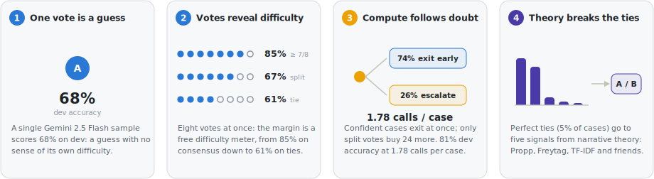
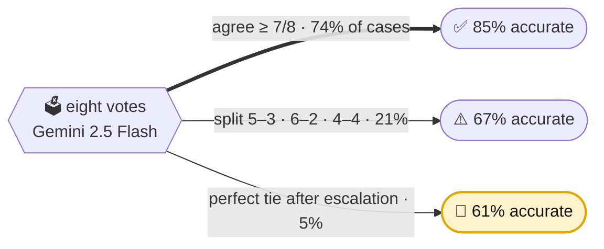
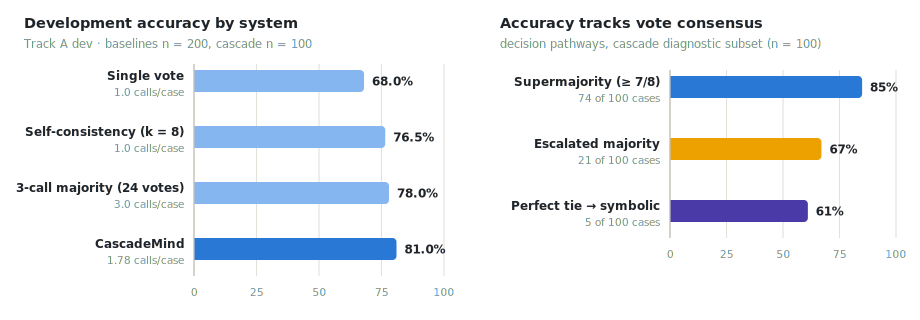
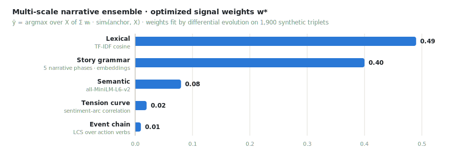

<div align="center">

<a href="https://2026.aclweb.org/"></a>
&nbsp;&nbsp;&nbsp;&nbsp;
<a href="https://www.epochlearn.com/"></a>

<br/><br/>

# CascadeMind

### A Hybrid Neuro-Symbolic Cascade for **Narrative Similarity**

**Sebastien Kawada** · **Dylan Holyoak**

<sub>Kaons · Epoch Learn · SemEval-2026 Task 4 (Narrative Story Similarity) · SemEval-2026 @ [ACL 2026](https://2026.aclweb.org/), San Diego</sub>

<br/>

**Two stories can share every word and no plot, or every plot beat and no words.** CascadeMind
decides which of two candidates is the true narrative neighbor of an anchor story. It lets
eight LLM votes measure their own uncertainty, buys more votes *only* where they disagree, and
calls in narrative theory *only* when the vote is a perfect tie.

<br/>

[](paper/latest-paperfeb12026/semeval2026_final.tex)
[](https://narrative-similarity-task.github.io/data/)
[](https://narrative-similarity-task.github.io/results/)

[](#-headline-result)
[](#-headline-result)
[](#-how-cascademind-works)

[](requirements.txt)
[](LICENSE)


</div>

---

> **TL;DR.** Ask an LLM the same question eight times and the answers do more than vote:
> **their agreement predicts how hard the question is.** On SemEval-2026 Task 4, supermajority
> cases (≥ 7/8 votes) resolve at **85%** accuracy, split votes at **67%**, and perfect ties at
> **61%**, a monotone gradient that holds across the development set. CascadeMind turns that
> gradient into a routing policy: eight Gemini 2.5 Flash votes settle the easy cases instantly,
> split votes escalate to 32 votes, and only perfect ties (5% of cases) fall through to a
> symbolic ensemble built from narrative theory. The official result: **72.75% on Track A
> test, 10th of 44 teams**, at **1.78 LLM calls per case**. That beats a fixed 3-call majority
> vote with 41% fewer calls. And the ablations say the quiet part out loud: nearly all of the
> gain comes from choosing *when* to spend compute, not from the symbolic representations
> themselves.

<div align="center">

**[The idea](#-the-idea-in-four-panels)** · **[How it works](#-how-cascademind-works)** · **[Headline result](#-headline-result)** · **[Ablations](#-where-the-gains-come-from)** · **[Quickstart](#-quickstart)** · **[Citation](#-citation)**

</div>

---

## Contents

- [The idea, in four panels](#-the-idea-in-four-panels)
- [Why narrative similarity is hard](#-why-narrative-similarity-is-hard)
- [How CascadeMind works](#-how-cascademind-works)
- [Headline result](#-headline-result)
- [Accuracy tracks vote consensus](#-accuracy-tracks-vote-consensus)
- [The symbolic tiebreaker](#-the-symbolic-tiebreaker)
- [Where the gains come from](#-where-the-gains-come-from)
- [What the ablations admit](#-what-the-ablations-admit)
- [Quickstart](#-quickstart)
- [Reproduce the paper](#-reproduce-the-paper)
- [Repository layout](#-repository-layout)
- [Data policy](#-data-policy)
- [Citation](#-citation)
- [License](#-license)

---

## ✦ The idea, in four panels

<div align="center">
<picture>
  <source media="(prefers-color-scheme: dark)" srcset="assets/idea-dark.svg">
  
</picture>
</div>

One sample is a guess. Eight samples are a guess **plus a difficulty meter**. And once you can
see difficulty, you can route it: confident cases exit immediately, split votes buy more
samples, and the rare perfect tie goes to narrative theory. That is the whole system. The rest
of this page is the evidence.

---

## ✦ Why narrative similarity is hard

Given an **anchor** story and two candidates, pick the candidate that is more *narratively*
similar. The comparison runs over Wikipedia plot synopses and deliberately reaches past
surface wording ([Hatzel et al., 2026](https://arxiv.org/abs/2604.21782)):

| Aspect | The question it asks |
|:--|:--|
| 🎭 **Abstract theme** | Do the stories run on the same ideas and motives? |
| 🧭 **Course of action** | Do the events unfold the same way? |
| 🏁 **Outcome** | Do they resolve to the same place? |

LLMs read semantics well, but narrative comparison is full of genuinely ambiguous cases where
two readings are both defensible. A single sample collapses that ambiguity into a coin flip,
and it never tells you which cases it flipped on.

### The key observation: the vote margin is a free difficulty meter

Sample eight votes instead of one, and the *distribution*, not just the majority, starts
carrying signal. On the development set the gradient is strictly monotone:



<div align="center">
<sub>Dev-set pathway accuracies (cascade diagnostic subset, n=100; tie accuracy on a separate perfect-tie set, n=18). Consistent with multi-sample consistency as a black-box uncertainty signal (Xiong et al., 2024).</sub>
</div>

Best of all, the meter costs nothing: Gemini's `candidateCount=8` returns all eight votes in
**one API call**. The design question stops being "how do we reason better?" and becomes
"what should each difficulty tier *buy*?"

---

## ✦ How CascadeMind works

CascadeMind is a **consensus-gated cascade**: a voting stage that decides who needs more
compute, an escalation stage that buys it, and a symbolic stage that catches the cases voting
cannot resolve at all.

<div align="center">
<picture>
  <source media="(prefers-color-scheme: dark)" srcset="assets/architecture-dark.svg">
  
</picture>

<sub>Exit percentages show the routing of the 100 dev diagnostic cases. Expected cost: 1.78 API calls per case.</sub>
</div>

| # | Stage | Runs when | What it does |
|:--:|:--|:--|:--|
| **1** | **Self-consistency vote** | always | One Gemini 2.5 Flash call (`candidateCount=8`, T=1.0) on a direct comparative prompt → eight independent A/B votes as JSON. No chain-of-thought is requested or used. |
| **·** | **Consensus gate** | ≥ 7/8 agree | **Exit.** 74% of dev cases stop here, and this slice is also the most accurate (85%). |
| **2** | **Escalation** | split vote (5–3, 6–2, 4–4) | Three additional calls → 32 votes total; the majority decides (21% of cases, 67%). |
| **3** | **Symbolic tiebreaker** | perfect 16–16 tie | Five theory-inspired similarity signals vote through weights fit by differential evolution (5% of cases, 61%). |

Two design choices fall straight out of the gradient:

- **The gate is aggressive (7/8 ≈ 87.5% consensus)** because the supermajority slice is both
  huge and accurate. Spending verification there would be almost pure cost.
- **The symbolic ensemble stays in the basement.** Applied to *all* cases instead of just
  ties, its accuracy drops to 53%. It earns its keep only where the neural signal is exactly
  zero.

> A guardrail from the paper: the vote margin is a **routing signal**, not a calibrated
> probability. It decides *who gets more compute*. No logits, no calibration step, just
> agreement across samples.

---

## ✦ Headline result

SemEval-2026 Task 4 drew **71 final submissions from 46 teams** across both tracks, and
**44 teams** earned a ranked Track A entry. CascadeMind scored **72.75%** on the official
Track A test split and finished **10th of 44**, as listed in the
[official results](https://narrative-similarity-task.github.io/results/) and the task overview
paper.

<div align="center">

| Result | Split | Accuracy |
|:--|:--|:--:|
| 🏆 **Official submission** | Track A test (n=400) | **72.75%** (291/400) |
| Post-hoc archived run | released test labels | 73.0% (292/400) |
| Cascade diagnostics | dev subset (n=100) | 81.0% |

<sub>The post-hoc run re-scores an archived local prediction file after the test labels were released; one prediction differs from the submitted file, and it changes nothing about the official standing. Dev baselines below use the full dev split (n=200), so cross-block deltas are descriptive.</sub>

</div>

---

## ✦ Accuracy tracks vote consensus

The left panel is the systems comparison. The right panel is the reason the comparison comes
out this way.

<div align="center">
<picture>
  <source media="(prefers-color-scheme: dark)" srcset="assets/results-dark.svg">
  
</picture>
</div>

CascadeMind beats the fixed 3-call majority vote **while using 41% fewer calls** (1.78 vs 3.0
per case), because escalation is bought *only* for the 26% of cases whose vote margin says
they need it. The supermajority slice, 74% of everything the system sees, is settled by a
single API call.

---

## ✦ The symbolic tiebreaker

When 32 votes split exactly 16–16, the neural signal is spent. What remains is theory. The
**Multi-Scale Narrative Analysis Ensemble** votes through five similarity signals at different
levels of narrative abstraction: classical narratology, operationalized.

<div align="center">
<picture>
  <source media="(prefers-color-scheme: dark)" srcset="assets/ensemble-dark.svg">
  
</picture>
</div>

| Signal | Grounding | What it measures |
|:--|:--|:--|
| **Lexical** | TF–IDF | Surface overlap in wording, situations, and domain terms |
| **Story grammar** | Propp · Freytag · Thorndyke | Embedding similarity across five aligned narrative phases (setting → resolution) |
| **Semantic** | all-MiniLM-L6-v2 | Whole-story sentence-embedding similarity |
| **Tension curve** | Freytag's pyramid · story arcs | Correlation of sentiment-derived tension trajectories |
| **Event chain** | Narrative event chains | Longest common subsequence over ordered action verbs |

Weights are fit by **differential evolution** on the organizer-provided synthetic split (1,900
LLM-generated triplets, used *only* for calibration). The optimizer pushes 89% of the mass
onto the lexical (0.49) and story-grammar (0.40) signals. In that data, narrative similarity
apparently lives at the surface and structural levels.

---

## ✦ Where the gains come from

Every step of the cascade earns its increment on dev, and it is the routing, not the symbolic
component, that carries the system:

<div align="center">

| Config. | Accuracy | Calls/case |
|:--|:--:|:--:|
| Single vote | 68.0% | 1.00 |
| Self-consistency (k=8) | 76.5% | 1.00 |
| 3-call majority (24 votes) | 78.0% | 3.00 |
| **CascadeMind** (vote → gate → escalate) | **81.0%** | **1.78** |
| + symbolic tiebreaker | 81.0% | 1.78 |

<sub>Track A dev. Baselines on the full split (n=200), cascade rows on the diagnostic subset (n=100). The tiebreaker touches only 5 of 100 cases, so its end-to-end effect rounds away; see below.</sub>

</div>

As a stand-alone check, the symbolic module *is* above chance. It is also far below the
cascade:

<div align="center">

| Symbolic-only run | n | Accuracy | Macro F1 |
|:--|:--:|:--:|:--:|
| Track A dev | 200 | 57.0% | 57.0 |
| Track A test (released labels) | 400 | 60.5% | 60.4 |

<sub>Fixed paper weights, zero LLM calls. An above-chance fallback, not a stand-alone classifier.</sub>

</div>

---

## ✦ What the ablations admit

The paper is deliberately candid about where the design pays off and where it doesn't:

- **The symbolic component contributes negligibly end-to-end.** It decides 5% of cases at 61%
  accuracy; removing it costs nothing measurable on dev. The cascade's value is the *routing*.
- **Synthetic calibration met reality.** The ensemble hits 99.5% on held-out synthetic
  validation and 61% on real perfect ties, a textbook domain-mismatch gap.
- **Dev → test is a real drop** (81.0% diagnostic → 72.75% official), consistent with
  distribution shift and the harder final setting.
- **There is a measurable B-bias.** The system picks B 53.5% of the time against a 48% label
  rate, and A-recall (68.8%) trails B-recall (77.6%). Fixing that decision bias is the
  clearest next win.

> The takeaway is methodological: for narrative similarity, **calibrating when to spend more
> compute on a hard instance matters more than adding auxiliary representations to reason
> about it.**

---

## ✦ Quickstart

```bash
git clone https://github.com/epoch-learn/CascadeMind.git
cd CascadeMind

python3 -m venv .venv && source .venv/bin/activate
pip install -r requirements.txt
```

Set your key (scripts read environment variables directly; they do not auto-load `.env`):

```bash
cp .env.example .env      # fill in, then:
set -a; source .env; set +a
```

Run the entrypoints:

```bash
python best.py              # bidirectional self-consistency evaluator (Gemini)
python baseline.py          # minimal structured-output baseline
python train_ensemble.py    # fit the symbolic ensemble weights (differential evolution)
```

> **Requirements:** Python 3.10+ and a Gemini API key. Use a fresh key, never one that has
> appeared in chat logs, screenshots, or git history. Task data is not distributed with this
> repository; see [Data policy](#-data-policy).

---

## ✦ Reproduce the paper

Camera-ready experiments go through the manifested harness, which records model IDs,
parameters, call counts, row counts, and the git commit for every run:

```bash
python scripts/run_camera_ready_experiments.py \
  --data data/dev_track_a.jsonl \
  --suite balanced \
  --max-examples 5
```

Build the paper from the canonical source, and sanity-check the tree before publishing
anything:

```bash
cd paper/latest-paperfeb12026 && latexmk -pdf -interaction=nonstopmode -halt-on-error semeval2026_final.tex
python scripts/check_release.py        # public-release + camera-ready checks
```

Camera-ready facts and the manual `pdflatex`/`bibtex` fallback live in
[`paper/README.md`](paper/README.md).

---

## ✦ Repository layout

```
CascadeMind/
├── best.py                  bidirectional self-consistency evaluator (Gemini)
├── baseline.py              minimal Gemini structured-output baseline
├── train_ensemble.py        multi-scale narrative ensemble trainer (differential evolution)
├── experiments/             historical variants & ablations (v3 … v15), kept for the record
├── scripts/
│   ├── run_camera_ready_experiments.py   manifested Gemini rerun harness
│   └── check_release.py                  public-release sanity checks
├── data/                    task data stays local-only (see data/README.md)
├── paper/                   camera-ready LaTeX source, ACL style, build notes
├── assets/                  README figures (light/dark SVG) + logos
├── requirements.txt · CITATION.cff · LICENSE
```

---

## ✦ Data policy

Shared-task data and generated submission artifacts are **not tracked** here. Obtain them from
the [task data page](https://narrative-similarity-task.github.io/data/) and the organizers'
[dataset repository](https://github.com/narrative-similarity-task/narrative-similarity-dataset);
expected filenames, row counts, and verification checksums are documented in
[`data/README.md`](data/README.md). Local run outputs belong under gitignored
`artifacts/runs/` directories.

---

## ✦ Citation

```bibtex
@inproceedings{kawada-holyoak-2026-cascademind,
  title     = {CascadeMind at SemEval-2026 Task 4: A Hybrid Neuro-Symbolic Cascade
               for Narrative Similarity},
  author    = {Kawada, Sebastien and Holyoak, Dylan},
  booktitle = {Proceedings of the 20th International Workshop on Semantic Evaluation (SemEval-2026)},
  year      = {2026},
  address   = {San Diego, CA, USA}
}
```

Please also cite the task:

```bibtex
@inproceedings{hatzel-etal-2026-semeval,
  title     = {{SemEval}-2026 Task 4: Narrative Story Similarity and Narrative Representation Learning},
  author    = {Hatzel, Hans Ole and Artemova, Ekaterina and Stiemer, Haimo Paul
               and Gius, Evelyn and Biemann, Chris},
  booktitle = {Proceedings of the 20th International Workshop on Semantic Evaluation (SemEval-2026)},
  year      = {2026},
  address   = {San Diego, CA, USA},
  doi       = {10.48550/arXiv.2604.21782},
  url       = {https://arxiv.org/abs/2604.21782}
}
```

---

## ✦ License

Code is released under the **MIT License** (© 2026 Sebastien Kawada & Dylan Holyoak). The
paper text and figures are scholarly work; please cite them as above.

<div align="center">
<sub>

**Paper:** [`paper/latest-paperfeb12026/`](paper/latest-paperfeb12026/semeval2026_final.tex) · **Task:** [SemEval-2026 Task 4](https://narrative-similarity-task.github.io/data/) · **Results:** [official leaderboard](https://narrative-similarity-task.github.io/results/) · **Org:** [Epoch Learn](https://www.epochlearn.com/)

Spend the votes where the stories are hard, and save the theory for the ties.

</sub>
</div>
